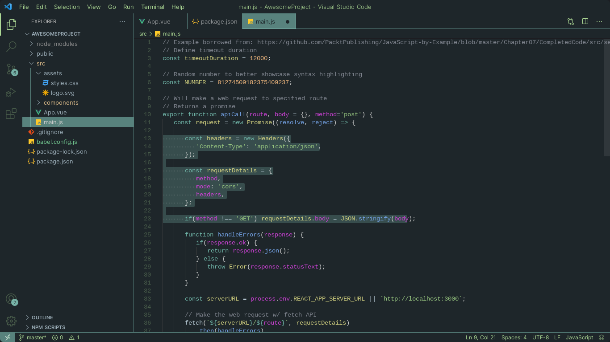

# Nova Theme

A VSCode dark theme based on the Nova color scheme.

Forewarning, this theme definitely needs some fine-tuning. Feel free to help with pull requests!

## Installation

### Method 1

1. Click [this link](https://marketplace.visualstudio.com/items?itemName=LA1CH3.nova-vscode-theme).
2. Click the "Install" button.

### Method 2

1. Within VSCode, click on "Extensions" on the activity bar.
2. Search for "Nova"
3. Install "Nova Theme" by LA1CH3
